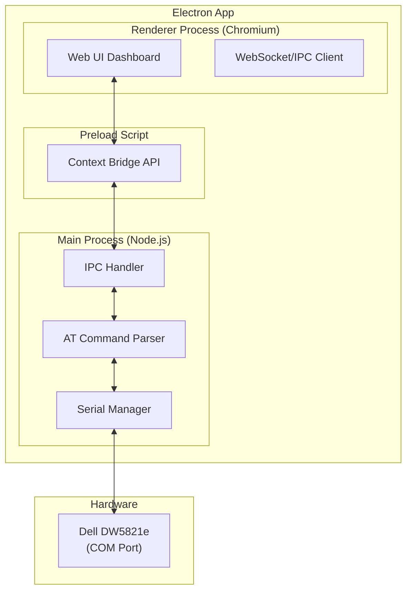

# Dell DW5821e Modem Manager — Web UI Desktop App

## Background & Riset

### Tentang Dell DW5821e
- **Chipset**: Qualcomm Snapdragon X20 LTE (juga dikenal sebagai **Fibocom L860-GL** / Foxconn T77W968)
- **Kategori**: LTE Cat 16 — Download hingga **1 Gbps**, Upload hingga **150 Mbps**
- **Form Factor**: M.2 (NGFF) Key B, dikomunikasikan via USB signaling
- **Protokol**: MBIM (Mobile Broadband Interface Model) / QMI
- **GPS**: Mendukung GPS, GLONASS, BeiDou
- **Carrier Aggregation**: Hingga 5xDL CA dan 2xUL CA

### Cara Mengontrol Modem
Modem ini **tidak punya web interface bawaan**. Kontrolnya dilakukan via:
1. **AT Commands** melalui Serial/COM Port (port "Application Interface" di Device Manager)
2. **Windows Cellular Settings** (untuk koneksi dasar)
3. **AT Commands** menggunakan terminal emulator (PuTTY, dll.)

### AT Commands Penting yang Akan Digunakan

| Command | Fungsi |
|---------|--------|
| `AT` | Test koneksi |
| `ATI` | Identifikasi device |
| `AT+CGSN` / `AT+GSN` | IMEI |
| `AT+CIMI` | IMSI |
| `AT+CPIN?` | Status SIM card |
| `AT+CSQ` | Signal strength (RSSI) |
| `AT+CREG?` | Status registrasi jaringan |
| `AT+COPS?` | Operator saat ini |
| `AT+COPS=?` | Scan operator tersedia |
| `AT+CGDCONT?` | Cek APN |
| `AT+CGDCONT=1,"IP","<apn>"` | Set APN |
| `AT+CFUN=0` / `AT+CFUN=1` | Disable/Enable radio |
| `AT+CGMI` | Manufacturer |
| `AT+CGMM` | Model |
| `AT+CGMR` | Firmware version |
| `AT+GTACT` | Band selection (proprietary Fibocom) |
| `AT+XDATACHANNEL` | Konfigurasi data channel |

---

## Arsitektur Aplikasi



### Tech Stack
| Layer | Technology |
|-------|-----------|
| **Desktop Framework** | Electron |
| **Backend/Serial** | Node.js + `serialport` library |
| **Frontend** | HTML + CSS + Vanilla JavaScript |
| **Styling** | Vanilla CSS (dark mode, glassmorphism, premium UI) |
| **Build ke EXE** | `electron-builder` |
| **IPC** | Electron IPC (Main ↔ Renderer via Preload) |

---

## Fitur-Fitur Aplikasi

### 1. Dashboard Utama
- Status koneksi modem (Connected/Disconnected)
- Signal strength gauge (visual meter RSSI → dBm)
- Network info (operator, tipe jaringan, registrasi)
- SIM card info (status, IMSI)
- Device info (model, IMEI, firmware)
- Data usage indicator

### 2. Connection Manager
- Pilih COM port (auto-detect atau manual)
- Connect/Disconnect serial port
- Baud rate selector (default 115200)
- Status indicator real-time

### 3. Network Settings
- APN configuration (view/set)
- Network operator selection (auto/manual scan)
- Band selection/locking
- Radio on/off toggle (`AT+CFUN`)

### 4. AT Command Terminal
- Terminal interaktif untuk kirim AT command manual
- Command history
- Response log dengan syntax highlighting
- Quick command buttons (preset AT commands umum)

### 5. Device Information
- Manufacturer, Model, Firmware version
- IMEI, IMSI
- SIM card status

### 6. Signal Monitor
- Real-time signal strength chart (grafik)
- RSSI, RSRP, RSRQ, SINR (jika tersedia)
- Auto-refresh setiap beberapa detik

---

## Desain UI

Design system: **Dark mode premium** dengan glassmorphism effects

- **Color Palette**: Deep navy (#0a0e27) → Electric blue (#00d4ff) → Purple accent (#7c3aed)
- **Cards**: Glassmorphism dengan backdrop-filter blur
- **Typography**: Google Fonts — Inter untuk body, JetBrains Mono untuk terminal
- **Animations**: Smooth transitions, pulse effects untuk signal, typing animation untuk terminal
- **Layout**: Sidebar navigation + Main content area
- **Responsive**: Minimum 800x600 window

---

## Struktur File

```
dell-dw5821e-ui/
├── package.json
├── main.js                  # Electron main process
├── preload.js               # Secure bridge (contextBridge)
├── src/
│   ├── index.html           # Main HTML
│   ├── css/
│   │   └── style.css        # Premium dark theme CSS
│   ├── js/
│   │   ├── app.js           # Main frontend logic
│   │   ├── dashboard.js     # Dashboard module
│   │   ├── terminal.js      # AT command terminal
│   │   ├── network.js       # Network settings
│   │   ├── signal.js        # Signal monitor
│   │   └── utils.js         # Helper functions
│   └── assets/
│       └── icon.png         # App icon
├── electron-builder.yml     # Build configuration
└── README.md
```

---

## User Review Required

> [!IMPORTANT]
> **Build ke EXE**: Rencana menggunakan `electron-builder` untuk package ke `.exe`. Ini akan menghasilkan installer atau portable EXE. Apakah mau **installer (NSIS)** atau **portable EXE**?

> [!IMPORTANT]  
> **Serial Port Access**: Aplikasi ini membutuhkan driver Dell DW5821e yang sudah terinstall agar COM port muncul di Device Manager. Pastikan driver sudah diinstall sebelum menggunakan aplikasi.

## Open Questions

1. **Bahasa UI**: Apakah ingin UI dalam **Bahasa Indonesia** atau **English**?
2. **Auto-connect**: Apakah ingin fitur auto-detect COM port dan auto-connect saat aplikasi dibuka?
3. **Signal monitoring interval**: Berapa detik sekali refresh signal strength? (Rekomendasi: 3-5 detik)
4. **Fitur tambahan**: Apakah ada fitur spesifik yang ingin ditambahkan? Misalnya:
   - SMS management (kirim/terima SMS via AT commands)
   - GPS/Location tracking
   - Data usage logging
   - Band lock profiles (simpan preset band favorit)
5. **Window size**: Apakah mau fixed size atau resizable? (Rekomendasi: resizable, min 800x600)

---

## Proposed Changes

### Electron Main Process

#### [NEW] [package.json](file:///d:/laragon/www/dell-dw5821e-ui/package.json)
- Project configuration, dependencies (electron, serialport, @serialport/parser-readline)
- Scripts: dev, start, build

#### [NEW] [main.js](file:///d:/laragon/www/dell-dw5821e-ui/main.js)
- Electron BrowserWindow creation
- Serial port management (connect, disconnect, send AT commands)
- IPC handlers untuk komunikasi dengan renderer
- COM port auto-detection via `SerialPort.list()`
- AT command queue & response parser

#### [NEW] [preload.js](file:///d:/laragon/www/dell-dw5821e-ui/preload.js)
- Context bridge API: `window.modemAPI`
  - `listPorts()` — list available COM ports
  - `connect(port, baudRate)` — connect to modem
  - `disconnect()` — disconnect
  - `sendCommand(cmd)` — send AT command
  - `onResponse(callback)` — listen for modem responses
  - `onConnectionStatus(callback)` — connection status events

---

### Frontend UI

#### [NEW] [src/index.html](file:///d:/laragon/www/dell-dw5821e-ui/src/index.html)
- Main HTML layout: sidebar + content area
- Sections: Dashboard, Network, Terminal, Signal Monitor, Device Info

#### [NEW] [src/css/style.css](file:///d:/laragon/www/dell-dw5821e-ui/src/css/style.css)
- Premium dark mode theme
- Glassmorphism cards
- Signal strength gauge animations
- Terminal styling (monospace, syntax colors)
- Smooth transitions & micro-animations
- Responsive layout

#### [NEW] [src/js/app.js](file:///d:/laragon/www/dell-dw5821e-ui/src/js/app.js)
- Main application logic, page routing, navigation
- COM port connection management UI
- Event listeners & state management

#### [NEW] [src/js/dashboard.js](file:///d:/laragon/www/dell-dw5821e-ui/src/js/dashboard.js)
- Dashboard widgets (signal, network, device info cards)
- Real-time status updates

#### [NEW] [src/js/terminal.js](file:///d:/laragon/www/dell-dw5821e-ui/src/js/terminal.js)
- Interactive AT command terminal
- Command history, response log
- Quick command preset buttons

#### [NEW] [src/js/network.js](file:///d:/laragon/www/dell-dw5821e-ui/src/js/network.js)
- APN settings form
- Operator selection
- Band management
- Radio toggle

#### [NEW] [src/js/signal.js](file:///d:/laragon/www/dell-dw5821e-ui/src/js/signal.js)
- Real-time signal chart (Canvas-based)
- Auto-refresh mechanism

#### [NEW] [src/js/utils.js](file:///d:/laragon/www/dell-dw5821e-ui/src/js/utils.js)
- AT response parser helpers
- RSSI to dBm conversion
- Signal quality calculation

---

### Build Configuration

#### [NEW] [electron-builder.yml](file:///d:/laragon/www/dell-dw5821e-ui/electron-builder.yml)
- Windows build target (NSIS installer / portable)
- App metadata (name, version, icon)
- File associations

---

## Verification Plan

### Automated Tests
1. `npm install` — pastikan semua dependencies terinstall
2. `npm start` — jalankan app dalam development mode
3. Test koneksi serial port (jika modem tersedia)
4. Test semua AT commands via terminal bawaan
5. `npm run build` — build ke EXE (verifikasi output)

### Manual Verification
1. Verifikasi UI tampil dengan benar (dark mode, glassmorphism)
2. Test connect/disconnect ke COM port
3. Test kirim AT command dan terima response
4. Verifikasi signal strength gauge bergerak real-time
5. Test APN setting dan operator selection
6. Test build EXE bisa dijalankan standalone
