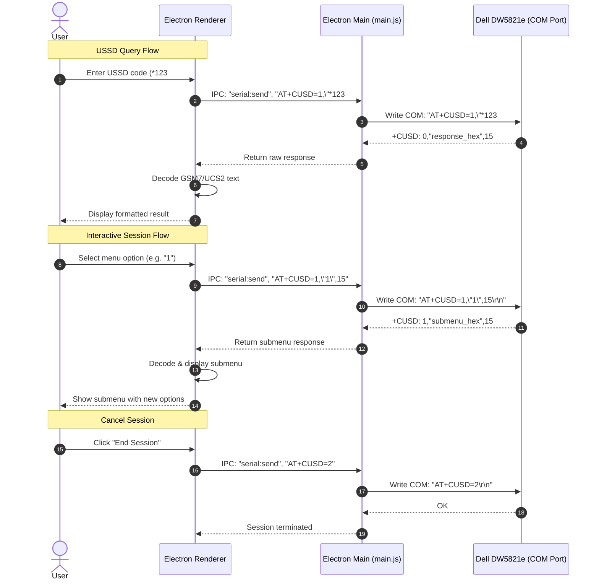

# Product Requirement Document (PRD): Dial / USSD Module
## Dell DW5821e Modem Manager (Electron App)

This document defines the requirements, system architecture, and technical specifications for the Dial / USSD module in the **Dell DW5821e Modem Manager** desktop application.

---

## 1. Overview & Objectives

The Dial / USSD Module provides a premium desktop interface for executing USSD (Unstructured Supplementary Service Data) commands on the Dell DW5821e Qualcomm-based LTE modem. USSD is the protocol behind short codes like `*123#` (cek pulsa), `*888#` (info paket), `*100#` (menu operator), etc.

### Key Objectives:
- **USSD Session Management**: Support both single-shot USSD queries and interactive multi-step USSD sessions (menu navigation with reply options).
- **Direct Serial Port Communication**: Leverage the existing `serial:send` IPC bridge in Electron Main to relay AT+CUSD commands to the modem.
- **Real-time Response Display**: Decode and display USSD response text (GSM 7-bit or UCS2) in real-time with proper Unicode rendering.
- **Quick Dial Presets**: Provide a library of commonly used USSD codes for Indonesian operators (Telkomsel, Indosat, XL, Tri, Smartfren) with one-click execution.
- **Session History**: Maintain a log of recent USSD sessions for reference.

---

## 2. System Architecture & Data Flow

The architecture follows the same three-layer model as the SMS module:

1. **Frontend (Electron Renderer)**: Manages UI events, formats USSD requests, decodes responses (GSM 7-bit / UCS2), and handles interactive session flow.
2. **Backend (Electron Main - `main.js`)**: Relays AT commands from Renderer to serial port via IPC.
3. **Hardware (Dell DW5821e Modem)**: Executes USSD AT commands and returns encoded responses.

### Data Flow Diagram



---

## 3. Functional Requirements

### 3.1. USSD Code Execution
- **Code Input**: Free-text input field for entering any USSD code (e.g. `*123#`, `*888*1#`).
- **Validation**: Ensure the input matches USSD pattern: starts with `*` or `#`, contains digits, `*`, and `#`, ends with `#`.
- **Execution**: Send the USSD code via `AT+CUSD=1,"<code>",15` and await the `+CUSD` response.

### 3.2. Response Decoding
- **DCS 15 (GSM 7-bit default)**: Decode the response text as plain ASCII/GSM characters.
- **DCS 72 (UCS2)**: Decode hexadecimal UCS2 response to Unicode text — handles Indonesian characters and special symbols.
- **DCS auto-detection**: Parse the DCS value from `+CUSD: <n>,"<text>",<dcs>` to determine encoding.

### 3.3. Interactive USSD Sessions
- **Session State Tracking**: Track whether a USSD session is active based on the `+CUSD` response code:
  - `0` = No further action required (session complete)
  - `1` = Further user action required (session still active — show reply input)
  - `2` = USSD terminated by network
  - `4` = Operation not supported
- **Reply Input**: When session is active (`+CUSD: 1,...`), show a reply input field for the user to enter menu option numbers.
- **Cancel Session**: Allow the user to manually end an active session via `AT+CUSD=2`.

### 3.4. Quick Dial Presets
- **Preset Library**: Pre-configured USSD codes organized by operator/category:
  - **Pulsa & Saldo**: `*123#`, `*888#`, `*100#`
  - **Paket Data**: `*363#`, `*123*5#`, `*100*1#`
  - **Info Nomor**: `*808#`, `*123*7*3#`
  - **Transfer Pulsa**: `*858#`, `*123*6#`
  - **Custom**: User can add their own frequently-used codes
- **One-click Execution**: Click a preset to instantly dial the code.
- **Editable Labels**: Users can rename preset labels for personalization.

### 3.5. Session History
- **Log**: Store the last 20 USSD sessions with timestamp, code dialed, and response text.
- **In-memory Storage**: History is stored in runtime memory (cleared on app restart — no persistent storage needed).
- **Quick Re-dial**: Click any history entry to re-execute the same USSD code.

---

## 4. Technical Specifications & AT Commands

| Command | Action | Description |
| :--- | :--- | :--- |
| `AT+CUSD=1,"<code>",15` | Execute USSD | Sends a USSD code to the network. DCS=15 indicates GSM 7-bit encoding for the request. |
| `AT+CUSD=1,"<reply>",15` | Reply to USSD | Sends a reply within an active USSD session (e.g. menu selection "1", "2", etc.). |
| `AT+CUSD=2` | Cancel USSD | Terminates an active USSD session. |
| `AT+CUSD=0` | Disable USSD | Disables USSD result presentation (not typically needed). |
| `AT+CUSD?` | Query USSD Mode | Returns current USSD presentation mode. |

### Response Format

```
+CUSD: <n>[,"<text>",<dcs>]
```

| Field | Description |
| :--- | :--- |
| `<n>` | 0 = no further action, 1 = further action needed, 2 = terminated, 4 = not supported |
| `<text>` | Response string — plain text (DCS 15) or hex-encoded UCS2 (DCS 72) |
| `<dcs>` | Data Coding Scheme: 15 = GSM 7-bit, 72 = UCS2 hex |

---

## 5. Algorithmic Specifications (JavaScript Implementation)

### 5.1. USSD Response Decoder

```javascript
/**
 * Parse +CUSD response line
 * Input: '+CUSD: 1,"Sisa pulsa Rp 50.000",15'
 * Returns: { status: 1, text: "Sisa pulsa Rp 50.000", dcs: 15, sessionActive: true }
 */
function parseCUSD(response) {
    const match = response.match(/\+CUSD:\s*(\d+)(?:,"([^"]*)"(?:,(\d+))?)?/);
    if (!match) return null;
    
    const status = parseInt(match[1]);
    const rawText = match[2] || '';
    const dcs = match[3] ? parseInt(match[3]) : 15;
    
    let decodedText = rawText;
    
    // DCS 72 = UCS2 hex-encoded
    if (dcs === 72 && /^[0-9A-Fa-f]+$/.test(rawText)) {
        decodedText = '';
        for (let i = 0; i < rawText.length; i += 4) {
            decodedText += String.fromCharCode(
                parseInt(rawText.substring(i, i + 4), 16)
            );
        }
    }
    
    return {
        status,
        text: decodedText,
        dcs,
        sessionActive: status === 1
    };
}
```

### 5.2. USSD Code Validator

```javascript
/**
 * Validate USSD code format
 * Valid: *123#, *888*1#, #100#, *123*4*5#
 */
function isValidUssd(code) {
    return /^[*#][0-9*#]+#$/.test(code);
}
```

---

## 6. User Interface Requirements

The SMS page layout should feature four core widgets:

1. **Dial Pad / Input Area**:
   - Large input field for entering USSD codes with monospace font.
   - "Dial" / "Execute" button with phone dial icon.
   - "Cancel Session" button (visible only during active session).
   - Reply input field (appears below response when session is active).

2. **Response Display**:
   - Full-width card displaying the decoded USSD response text.
   - Clear visual formatting with line breaks preserved.
   - Session status indicator (Active / Complete / Error).
   - Animated transition when new response arrives.

3. **Quick Dial Presets Grid**:
   - Grid of preset buttons organized by category tabs (Pulsa, Paket, Info, Custom).
   - Each preset shows icon + label + USSD code.
   - Hover effect reveals the full USSD code.
   - "Add Custom" button to save new presets.

4. **Session History Log**:
   - Compact scrollable list showing recent USSD sessions.
   - Each entry: timestamp, USSD code, truncated response preview.
   - Click to re-dial or expand to view full response.
