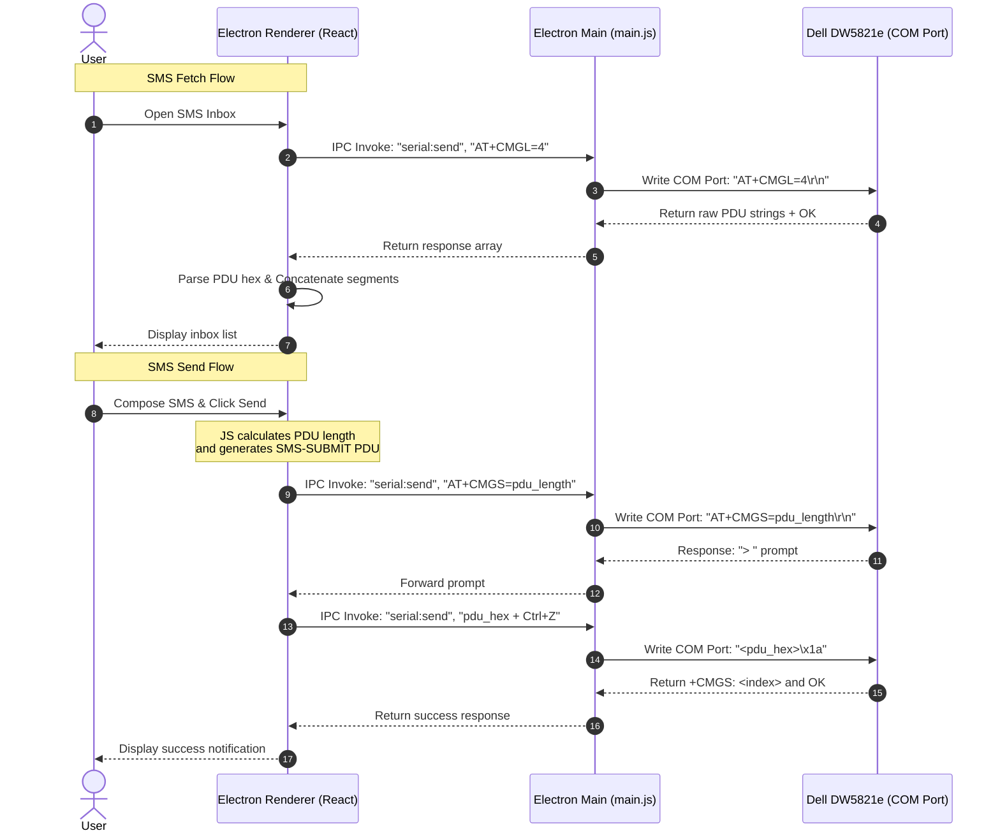

# Product Requirement Document (PRD): SMS Module
## Dell DW5821e Modem Manager (Electron App)

This document defines the requirements, system architecture, and technical specifications for the SMS module in the **Dell DW5821e Modem Manager** desktop application.

---

## 1. Overview & Objectives

The SMS Module provides a premium desktop interface for managing SMS messages directly on the Dell DW5821e Qualcomm-based LTE modem.

### Key Objectives:
- **PDU-Based Communication**: Utilize standard 3GPP PDU (Protocol Description Unit) mode to support robust multi-language text message operations (including Unicode, Emojis, and local characters).
- **Direct Serial Port Pipe**: Leverage Node.js `serialport` in the Electron Main process to communicate with the modem over COM ports.
- **Client-Side Processing**: Perform all PDU encoding (for sending) and decoding/concatenation (for reading) entirely in JavaScript within the Electron environment (no Python backend required).
- **Inbox & Concat Support**: Automatically merge incoming multi-segment messages into unified threads based on UDH (User Data Headers).

---

## 2. System Architecture & Data Flow

The architecture consists of three distinct layers running locally on the desktop:

1. **Frontend (Electron Renderer / React)**: Coordinates UI events, encodes composed text to PDU format, decodes received PDUs, and handles message concatenation.
2. **Backend (Electron Main - `main.js`)**: Manages the connection pool, handles COM port auto-detection, and relays AT commands from the Renderer process to the serial port via IPC (`ipcMain`).
3. **Hardware (Dell DW5821e Modem)**: Executes standard cellular AT commands over the serial port interface.

### Data Flow Diagram



---

## 3. Functional Requirements

### 3.1. SMS Inbox & Multi-part Concat (SMS-DELIVER)
- **Modem Initialization**: On module load, configure SMS parameters:
  - `AT+CMGF=0` (PDU mode)
  - `AT+CSCS="GSM"` (Character set to GSM)
- **Inbox Listing**: Fetch all received messages.
- **PDU Parsing**: Decode hexadecimal PDUs to extract:
  - Sender phone number (with swapped semi-octets and cleaned local prefixes).
  - Accurate ISO timestamp (`YYYY-MM-DD HH:MM:SS`).
  - Text body (decoding 7-bit GSM default alphabet or 16-bit UCS2 encoding).
- **Concatenation**: Group and merge multi-segment messages matching the same sender and reference number in their User Data Headers (UDH).

### 3.2. SMS Sending (SMS-SUBMIT)
- **Recipient Input**: Validate and normalize phone numbers (e.g. converting `+` prefixes to standard formats).
- **Service Center Address (SMSC)**: Auto-populate the active SMSC querying `AT+CSCA?`.
- **Text Composition**: Support messages of any length. Long messages (> 70 Unicode chars) are split into concatenated PDU payloads automatically by the encoding routine.

### 3.3. SMS Storage & Memory Management
- **Memory Stats**: Fetch and display utilized slots vs. total slots using `AT+CPMS?` for SIM storage (`SM`) and internal modem storage (`ME`).
- **Deletion**: Support batch deleting of messages via the index IDs returned from listing.

---

## 4. Technical Specifications & AT Commands

| Command | Action | Description |
| :--- | :--- | :--- |
| `AT+CMGF=0` | Set PDU Mode | Sets the modem to process raw PDU payloads (universally supported by DW5821e). |
| `AT+CSCS="GSM"` | Set Charset | Sets character mode to GSM compatibility. |
| `AT+CMGL=4` | List Messages | Returns all SMS messages stored in the active memory buffer. |
| `AT+CPMS?` | Query Storage | Returns used/total stats for the active storage buffers. |
| `AT+CPMS="SM","SM","SM"` | Select Memory | Directs the modem to read/write SMS from/to the SIM card. |
| `AT+CSCA?` | Query SMSC | Returns the current SMS service center phone number. |
| `AT+CMGD=<index>` | Delete SMS | Deletes a message from the specified storage slot index. |
| `AT+CMGS=<pdu_len>` | Send SMS | Requests sending an SMS of length `<pdu_len>` (excluding SMSC bytes). Waits for the `>` prompt before receiving the PDU hex terminated with `\x1a`. |

---

## 5. Algorithmic Specifications (JavaScript Implementation)

### 5.1. SMS PDU Encoder (For Composer)
The following algorithm must be implemented in the Javascript application to generate the SMS-SUBMIT PDU for sending:

```javascript
// Swapping helper for semi-octet phone numbers
function swapPhoneSemiOctets(number) {
    let clean = number.replace(/\D/g, ''); // Numbers only
    if (clean.length % 2 !== 0) {
        clean += 'F';
    }
    let swapped = '';
    for (let i = 0; i < clean.length; i += 2) {
        swapped += clean[i + 1] + clean[i];
    }
    return swapped;
}

// Convert string message to UCS2 hex bytes
function encodeToUcs2Hex(text) {
    let hex = '';
    for (let i = 0; i < text.length; i++) {
        let code = text.charCodeAt(i).toString(16).toUpperCase();
        hex += code.padStart(4, '0');
    }
    return hex;
}

/**
 * Encodes SMS submit parameters to PDU format
 * @param {string} smsc - Service Center Number (e.g. "+6281100000")
 * @param {string} recipient - Destination Number (e.g. "+62812345678")
 * @param {string} text - Message Body
 */
function encodeSmsSubmitPdu(smsc, recipient, text) {
    // 1. Service Center Header
    let formattedSmsc = swapPhoneSemiOctets(smsc.replace(/^\+/, ''));
    let smscLen = (formattedSmsc.length / 2) + 1;
    let smscPart = `${smscLen.toString(16).padStart(2, '0').toUpperCase()}91${formattedSmsc}`;

    // 2. Destination Number Header
    let cleanRecipient = recipient.replace(/^\+/, '');
    let formattedDest = swapPhoneSemiOctets(cleanRecipient);
    let destLenHex = cleanRecipient.length.toString(16).padStart(2, '0').toUpperCase();
    let destPart = `${destLenHex}91${formattedDest}`;

    // 3. User Data (Message Content)
    let ucs2Body = encodeToUcs2Hex(text);
    let bodyLenByte = (ucs2Body.length / 2).toString(16).padStart(2, '0').toUpperCase();

    // 4. Combine submit body
    // 11: SMS-SUBMIT indicator
    // 00: Message reference (Modem will assign)
    // destPart: Target destination header
    // 00: Protocol identifier (Sms default)
    // 08: Data coding scheme (UCS2 / Unicode)
    // A7: Validity Period (e.g., 24 hours)
    let pduBody = `1100${destPart}0008A7${bodyLenByte}${ucs2Body}`;

    return {
        smscPart: smscPart,
        pduBody: pduBody,
        fullPduHex: smscPart + pduBody,
        pduLength: pduBody.length / 2 // Length argument passed to AT+CMGS
    };
}
```

### 5.2. SMS PDU Decoder (For Inbox)
When the React frontend receives raw PDU lists from `AT+CMGL=4`, it processes each message PDU block:

1. **Service Center Offset**: Calculates the SMSC block size from the first octet, extracts SMSC address, and skips this block to read the message body.
2. **Sender Identification**: Reads the sender length and format, swaps semi-octets, and strips the international prefix (e.g., `62` or `86`) for UI rendering.
3. **Timestamping**: Decodes the 7-octet timestamp block using semi-octet swapping, converting it to standard timezone-aware Date objects.
4. **TP-DCS Decoding**:
   - If DCS is `08` (UCS2), translates every 4 hexadecimal characters to a Unicode code point.
   - If DCS is `00` (7-bit GSM), decodes the compressed 7-bit octet stream back to ASCII.
5. **UDH Concatenation**: If the User Data Header indicator (UDHI) bit is enabled in the PDU first octet:
   - Extract the 8-bit or 16-bit concatenation reference ID, total segments, and the current segment index.
   - Match, sort, and concatenate payload bodies.

---

## 6. User Interface Requirements

The layout should feature three core widgets:
1. **Thread Inbox Table**:
   - Displays sender, time, and full unified message body.
   - Unread indicator badges.
   - Batch selection checkboxes with an overlay action bar (*Delete selected*, *Mark as Read*).
2. **Composer Form**:
   - Fields: Recipient Number, Message (textarea with character count indicator).
   - Dynamic counter: shows remaining characters and split segment count (e.g., `53 / 70 (1 SMS)`).
   - Outgoing status spinner and toasts.
3. **Storage Usage Tracker**:
   - Compact progress bars indicating used space / total storage capacity (SIM card limit vs. modem memory limit).
